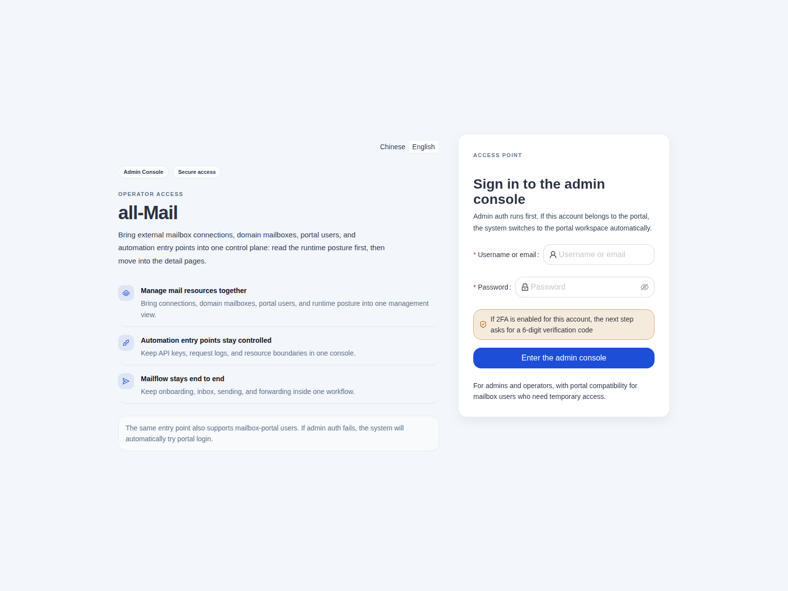
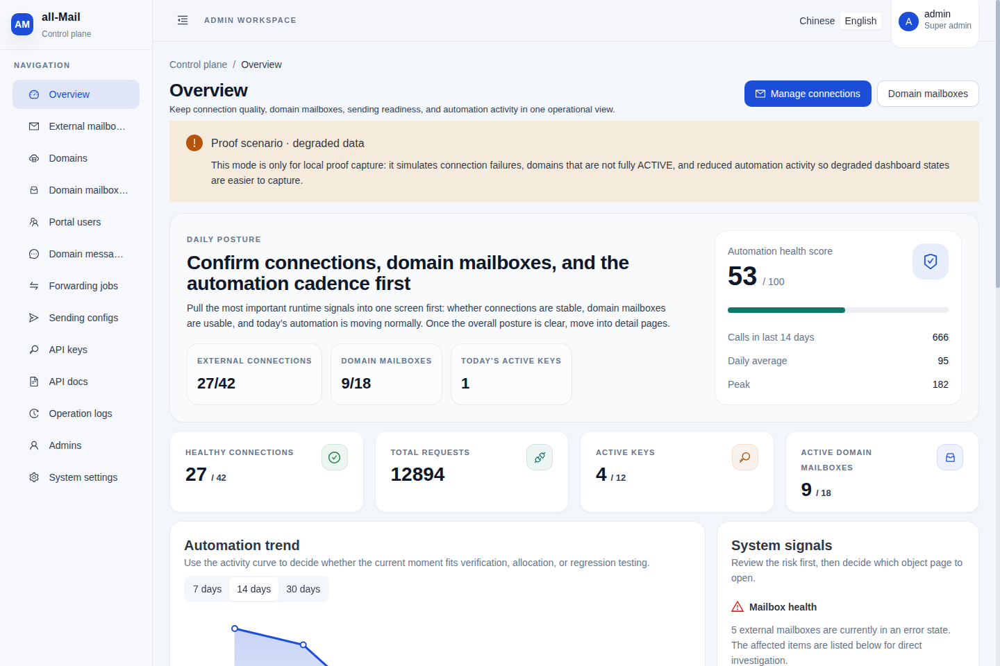
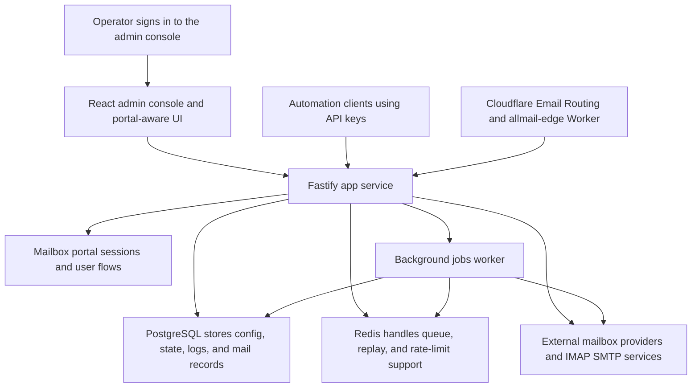

# all-Mail

`all-Mail` is a self-hostable email control plane for operators who need one place to manage:

- external mailbox providers (Outlook / Gmail / QQ and related IMAP/SMTP families)
- domain mailboxes, aliases, and portal users
- signed inbound ingress for domain mail flows
- outbound sending and automation-facing mailbox APIs

The repository is **Docker-first**. The default deployment shape is one Docker Compose stack for the app, jobs worker, PostgreSQL, and Redis.

## Product shape

`all-Mail` combines several operator workflows in one system:

- **external mailbox control** — connect and operate provider mailboxes from one admin console
- **domain mailbox control** — manage domains, mailboxes, aliases, and portal access
- **ingress control** — receive inbound mail through a signed Cloudflare worker path when needed
- **outbound sending** — manage send configs and outbound delivery flows
- **automation APIs** — expose script-friendly mailbox allocation and message retrieval endpoints

## Screenshots

| Admin sign-in | Dashboard overview |
| --- | --- |
|  |  |

Both images are repository-tracked, sanitized screenshots intended for GitHub-facing documentation. The dashboard image uses the local proof scenario so the README stays public-safe while still showing the real homepage shape.

## End-to-end control-plane flow



In practice, the project runs in four connected lanes:

1. **operator lane** — admins log in, read the dashboard posture, then move into mailbox, domain, sending, or log pages.
2. **automation lane** — API-key callers allocate mailboxes, fetch messages, and drive workflow automation through the backend.
3. **ingress lane** — Cloudflare Email Routing can send inbound domain-mail traffic through the Worker into the backend ingress endpoint.
4. **jobs lane** — the dedicated `jobs` runtime handles background forwarding, retries, cleanup, and other asynchronous mailflow work.

## Provider support

| Provider family | Typical auth path | Inbox read | Junk read | Clear mailbox | Send |
| --- | --- | --- | --- | --- | --- |
| Outlook | Microsoft OAuth | Yes | Yes | Yes | Yes |
| Gmail | Google OAuth / App Password | Yes | Yes | Google OAuth only | Yes |
| QQ | IMAP / SMTP auth code | Yes | Yes | No | Yes |
| 163 / 126 | IMAP / SMTP auth code | Yes | Yes | No | Yes |
| iCloud / Yahoo / Zoho / Aliyun | IMAP / SMTP app password | Yes | Yes | No | Yes |
| Fastmail / AOL / GMX / Mail.com / Yandex | IMAP / SMTP password or app password | Yes | Yes | No | Yes |
| Amazon WorkMail | IMAP / SMTP password + region-specific host | Yes | Yes | No | Yes |
| Custom IMAP / SMTP | User-defined IMAP / SMTP server settings | Yes | Yes | No | Yes |

## Quick start (canonical Docker path)

### 1. Choose an environment template

Default Docker deployment:

```bash
cp .env.example .env
```

If you also need Cloudflare Email Routing / signed ingress for domain-mail delivery:

```bash
cp .env.cloudflare.example .env
```

### 2. Start the stack

```bash
docker compose up -d --build
docker compose ps
```

Expected baseline services:

- `app`
- `jobs`
- `postgres`
- `redis`

After startup, `app` and `jobs` should settle into a healthy state in `docker compose ps`, while `postgres` and `redis` should report healthy from their own checks.

### 3. Probe health

```bash
curl http://127.0.0.1:3002/health
```

Expected response:

```json
{"success":true,"data":{"status":"ok"}}
```

### 4. First-login note

You may leave `JWT_SECRET`, `ENCRYPTION_KEY`, and `ADMIN_PASSWORD` blank on first boot.

`all-Mail` will generate them automatically and persist them for reuse:

- Docker runtime: `/var/lib/all-mail/bootstrap-secrets.env`
- source runtime: defaults to `.all-mail-runtime/bootstrap-secrets.env`; export `ALL_MAIL_STATE_DIR` before launch if you need a different bootstrap-state location

By default, startup prints the first-login URL and bootstrap admin username but keeps `ADMIN_PASSWORD` out of stdout. Retrieve generated passwords from the persisted bootstrap-secret file above, or set `ALL_MAIL_PRINT_BOOTSTRAP_PASSWORD=true` only for short-lived recovery in a controlled terminal. Change any generated password immediately after the first login.

## Canonical verification entrypoints

Use repo-root commands as the default verification contract:

| Command | Purpose |
| --- | --- |
| `./bin/all-mail doctor` | preferred readiness check; sanitizes Node proxy startup flags before running the local doctor |
| `./bin/all-mail check` | preferred full local release gate; sanitizes Node proxy startup flags before running lint, tests, builds, worker checks, and production dependency audits |
| `npm run verify:release` | compatibility alias for the full local release gate |
| `npm run check` | compatibility alias for `npm run verify:release` |

If your shell exports `NODE_USE_ENV_PROXY` or `HTTP[S]_PROXY`, prefer the `./bin/all-mail ...` entrypoints above. They avoid noisy `UNDICI-EHPA` warnings by sanitizing those startup flags before Node/npm bootstraps.

`./bin/all-mail doctor` is **not** the full release gate.

## Documentation map

Use the authoritative doc that matches the task instead of treating this README as the full runbook.

Only the files listed below should be treated as the public onboarding and operator contract. Internal design notes, planning artifacts, and historical rewrite references now live under [`docs/internal/`](docs/internal/README.md) and are not part of the primary setup path.

| Need | Canonical doc |
| --- | --- |
| Deploy, update, smoke check, rollback entry | [`docs/DEPLOY.md`](docs/DEPLOY.md) |
| Day-2 operations and recovery | [`docs/RUNBOOK.md`](docs/RUNBOOK.md) |
| Env variables and template ownership | [`docs/ENVIRONMENT.md`](docs/ENVIRONMENT.md) |
| External mailbox operations and provider-specific notes | [`docs/external-email-management-guide.md`](docs/external-email-management-guide.md) |
| Cloudflare worker deployment and ingress troubleshooting | [`CLOUDFLARE-DEPLOY.md`](CLOUDFLARE-DEPLOY.md) |
| Secondary npm/CLI source runtime | [`docs/advanced-runtime.md`](docs/advanced-runtime.md) |
| Public docs index inside `docs/` | [`docs/README.md`](docs/README.md) |
| Contribution workflow | [`CONTRIBUTING.md`](CONTRIBUTING.md) |
| Provenance / release-governance context | [`PROVENANCE.md`](PROVENANCE.md), [`docs/open-source-release-checklist.md`](docs/open-source-release-checklist.md) |

### Guided reading by job-to-be-done

| Goal | Start here | Then continue with |
| --- | --- | --- |
| Bring up the default local stack | [`README.md`](README.md#quick-start-canonical-docker-path) | [`docs/DEPLOY.md`](docs/DEPLOY.md), [`docs/ENVIRONMENT.md`](docs/ENVIRONMENT.md) |
| Troubleshoot a running Docker deployment | [`docs/RUNBOOK.md`](docs/RUNBOOK.md) | [`docs/DEPLOY.md`](docs/DEPLOY.md) |
| Operate external third-party mailboxes | [`docs/external-email-management-guide.md`](docs/external-email-management-guide.md) | [`docs/RUNBOOK.md`](docs/RUNBOOK.md) |
| Enable Cloudflare ingress for domain mail | [`CLOUDFLARE-DEPLOY.md`](CLOUDFLARE-DEPLOY.md) | [`docs/DEPLOY.md`](docs/DEPLOY.md), [`docs/ENVIRONMENT.md`](docs/ENVIRONMENT.md) |
| Validate release readiness before publishing changes | [`./bin/all-mail check`](./bin/all-mail) | [`docs/open-source-release-checklist.md`](docs/open-source-release-checklist.md) |

## Repository layout

```text
├── bin/                             # repo entrypoints such as ./bin/all-mail doctor/check
├── .env.example                     # default Docker-first environment template
├── .env.cloudflare.example          # Cloudflare-oriented Docker environment template
├── server/                          # Fastify + Prisma backend
├── web/                             # React admin console
├── cloudflare/workers/allmail-edge/ # Signed inbound mail worker
├── docs/                            # public deployment, environment, runbook, guides, screenshots, and docs index
│   ├── internal/                    # internal design notes, plans, and historical reference docs
│   └── screenshots/                 # sanitized README-safe product images
├── docker-compose.yml
└── Dockerfile
```

## Secondary runtime notes

The npm/CLI source-runtime path is still supported, but it is **not** the default onboarding path. Use it only when you intentionally need:

- app runtime outside the main Docker container
- hybrid mode (`docker compose` only for PostgreSQL / Redis)
- source-based global CLI workflows

See [`docs/advanced-runtime.md`](docs/advanced-runtime.md) for that path.

## Related release and support docs

- [`CONTRIBUTING.md`](CONTRIBUTING.md)
- [`SECURITY.md`](SECURITY.md)
- [`SUPPORT.md`](SUPPORT.md)
- [`CHANGELOG.md`](CHANGELOG.md)
- [`PROVENANCE.md`](PROVENANCE.md)
- [`docs/open-source-release-checklist.md`](docs/open-source-release-checklist.md)

## License

This repository is released under the custom **all-Mail Non-Commercial License**.

- non-commercial use, study, modification, and redistribution are allowed under the license terms
- commercial use is **not** allowed without prior written permission
- if you want commercial use rights, contact the repository owner first to discuss licensing
