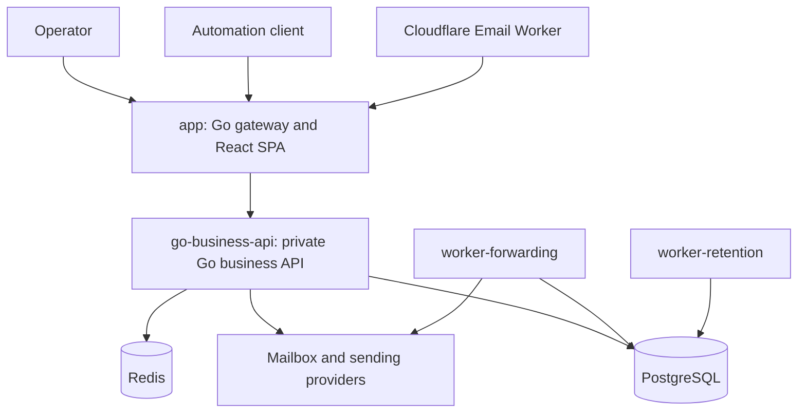

# all-Mail

`all-Mail` is a self-hostable email control plane for operators who need one place to manage:

- external mailbox providers such as Outlook, Gmail, QQ, and related IMAP/SMTP families;
- domain mailboxes, aliases, and portal users;
- signed inbound ingress for domain mail flows;
- outbound sending and automation-facing mailbox APIs.

The repository is Docker-first and the production runtime is Go-only. Go owns the public listener, React SPA, every business route, schema initialization, health/readiness, forwarding, and API-log retention. PostgreSQL and Redis remain private shared state backends.

## Product shape

`all-Mail` combines several operator workflows:

- **external mailbox control** - connect and operate provider mailboxes from one admin console;
- **domain mailbox control** - manage domains, mailboxes, aliases, and portal access;
- **ingress control** - receive inbound mail through a signed Cloudflare Worker path;
- **outbound sending** - manage send configurations and delivery flows;
- **automation APIs** - expose script-friendly mailbox allocation and message retrieval endpoints.

## Screenshots

| Admin sign-in | Dashboard overview |
| --- | --- |
|  |  |

The screenshots are repository-tracked and sanitized for public documentation.

## Runtime architecture


```mermaid
flowchart TD
    Operator[Operator] --> App[app: Go gateway and React SPA]
    Automation[Automation client] --> App
    Edge[Cloudflare Email Worker] --> App
    App --> Business[go-business-api: private Go business API]
    Business --> Postgres[(PostgreSQL)]
    Business --> Redis[(Redis)]
    Business --> Providers[Mailbox and sending providers]
    Forwarding[worker-forwarding] --> Postgres
    Forwarding --> Providers
    Retention[worker-retention] --> Postgres
```

The public `app` receives no PostgreSQL URL, Redis URL, JWT secret, encryption key, or provider credential. It serves the SPA and system endpoints, then proxies every business route to `go-business-api`. The private API receives PostgreSQL, Redis, and read-only JWT and encryption-key files and resolves database-encrypted provider credentials.

### Long-running services

| Service | Responsibility |
| --- | --- |
| `app` | Public Go gateway, React SPA, trusted-proxy boundary, readiness, metrics, and business proxy |
| `go-business-api` | Private Go authentication, administration, mailbox, domain, ingress, provider, sending, portal, and external APIs |
| `worker-forwarding` | Forwarding claim, send, retry, lease, and terminal state transitions |
| `worker-retention` | API-log retention |
| `postgres` | Application and runtime state; private to the Compose network |
| `redis` | Login protection, API-key limiting, OAuth state, ingress replay protection, and cache support; private to the Compose network |

Initialization is not a Compose service. The startup helper runs `app init` in a temporary container before starting the long-running stack.

## Provider support

| Provider family | Typical auth path | Inbox read | Junk read | Clear mailbox | Send |
| --- | --- | --- | --- | --- | --- |
| Outlook | Microsoft OAuth | Yes | Yes | Yes | Yes |
| Gmail | Google OAuth / App Password | Yes | Yes | Google OAuth only | Yes |
| QQ | IMAP / SMTP auth code | Yes | Yes | No | Yes |
| 163 / 126 | IMAP / SMTP auth code | Yes | Yes | No | Yes |
| iCloud / Yahoo / Zoho / Aliyun | IMAP / SMTP app password | Yes | Yes | No | Yes |
| Fastmail / AOL / GMX / Mail.com / Yandex | IMAP / SMTP password or app password | Yes | Yes | No | Yes |
| Amazon WorkMail | IMAP / SMTP password plus region-specific host | Yes | Yes | No | Yes |
| Custom IMAP / SMTP | User-defined server settings | Yes | Yes | No | Yes |

## Quick start

### 1. Create the production environment file

```bash
cp .env.example .env
openssl rand -hex 24
```

Set the generated value as `POSTGRES_PASSWORD`. Configure `INGRESS_SIGNING_SECRET`, OAuth inputs, `PUBLIC_BASE_URL`, and narrowly scoped `TRUSTED_PROXY_CIDRS` when those features are used.

`ADMIN_USERNAME` and `ADMIN_PASSWORD` are temporary initializer inputs. Leave `ADMIN_PASSWORD` blank to generate a strong one-time password. Remove any populated one-shot values from `.env` after initialization and verification.

### 2. Start the canonical stack

```bash
./scripts/compose-up.sh
docker compose ps -a
```

The helper validates `.env`, starts and waits for PostgreSQL, builds the shared Go image, runs a temporary `app init` container, then starts and waits for:

```text
app
go-business-api
worker-forwarding
worker-retention
postgres
redis
```

Only `app` is published to the host.

### 3. Probe health and readiness

```bash
curl http://127.0.0.1:3002/health
curl http://127.0.0.1:3002/livez
curl --fail http://127.0.0.1:3002/readyz

docker compose exec -T app allmail doctor api
docker compose exec -T go-business-api allmail doctor business-api
docker compose exec -T worker-forwarding allmail doctor worker forwarding
docker compose exec -T worker-retention allmail doctor worker retention
```

`/health` and `/livez` report public-process health. `/readyz` requires the built SPA and `go-business-api`; the private API readiness check requires PostgreSQL and Redis.

### 4. Retrieve the one-time password

```bash
docker compose exec go-business-api sh -lc \
  "grep '^ADMIN_USERNAME=' /var/lib/all-mail/bootstrap-admin.env && \
   grep '^ADMIN_PASSWORD=' /var/lib/all-mail/bootstrap-admin.env"
```

After login, the administrator must change the password. A successful first rotation removes `bootstrap-admin.env`. The initializer never prints the temporary password to logs.

Long-lived generated secrets remain in `/var/lib/all-mail/runtime-secrets.env` on `runtime_secrets_data`; least-privilege copies are exported to `forwarding_runtime_data` and `go_business_runtime_data`. Preserve PostgreSQL and all three secret volumes together for backup and restore.

## Trusted proxy contract

The Go listener discards incoming `Forwarded`, `X-Forwarded-*`, `X-Real-IP`, and `CF-Connecting-IP` values from untrusted socket peers. Only direct peers listed in `TRUSTED_PROXY_CIDRS` may supply client identity or forwarded protocol. Do not use blanket trust and do not publish `go-business-api`.

## Local development

Start PostgreSQL and Redis through the development overlay:

```bash
./bin/all-mail deps up
```

Initialize an isolated local database and secret directory, then run the private Go API:

```bash
(cd core && \
  DATABASE_URL='postgresql://allmail:<password>@127.0.0.1:15433/allmail' \
  ALL_MAIL_MIGRATION_DIR="$PWD/migrations" \
  ALL_MAIL_STATE_DIR="$PWD/../.all-mail-runtime" \
  ADMIN_USERNAME=admin \
  ADMIN_PASSWORD=change-me-now \
  go run ./cmd/allmail init)

npm run dev:api
npm run dev:web
```

Local `go-business-api` also requires `REDIS_URL`, `JWT_SECRET_FILE`, and `ENCRYPTION_KEY_FILE`; see [`docs/advanced-runtime.md`](docs/advanced-runtime.md) for the complete command.

## Upgrade, restore, and rollback

Before an upgrade, back up PostgreSQL, `.env`, `runtime_secrets_data`, `forwarding_runtime_data`, and `go_business_runtime_data`. Stop the old revision before starting the new one, then run the same startup helper:

```bash
git switch <target-tag-or-commit>
./scripts/compose-up.sh
```

For a restore, stop the stack, restore PostgreSQL and the matching secret volumes as one unit, select the matching application revision, and run `./scripts/compose-up.sh`.

Rollback is revision based. An image-only rollback is unsafe when the target revision does not understand the current schema or authentication state. Restore a database and secret-volume backup captured for the target revision whenever backward compatibility is not explicitly documented. Never run initializers or workers from two revisions against the same persisted state.

## Development and verification entrypoints

| Command | Purpose |
| --- | --- |
| `npm run docker:up` | Run the canonical production startup helper |
| `npm run dev:api` | Run the private Go business API locally |
| `go run ./cmd/allmail init` | Initialize schema, secrets, durable configuration, and the first administrator |
| `go run ./cmd/allmail migrate` | Apply/adopt schema without secret or administrator phases |
| `npm run dev:web` | Run the Vite frontend development server |
| `./bin/all-mail deps up` | Start PostgreSQL and Redis through the development overlay |
| `./bin/all-mail doctor` | Check local environment resolution, dependencies, and build artifacts |
| `./bin/all-mail check` | Run the full repository verification gate |
| `npm run test:runtime` | Run runtime and environment-contract tests |

## Documentation map

| Need | Canonical document |
| --- | --- |
| Deploy, update, smoke check, restore, and rollback | [`docs/DEPLOY.md`](docs/DEPLOY.md) |
| Day-2 operations and recovery | [`docs/RUNBOOK.md`](docs/RUNBOOK.md) |
| Environment variables and secret ownership | [`docs/ENVIRONMENT.md`](docs/ENVIRONMENT.md) |
| Completed Go migration and schema compatibility | [`docs/GO-MIGRATION.md`](docs/GO-MIGRATION.md) |
| Route ownership and metrics | [`docs/ROUTE-OWNERSHIP.md`](docs/ROUTE-OWNERSHIP.md) |
| Local API/frontend development | [`docs/advanced-runtime.md`](docs/advanced-runtime.md) |
| Cloudflare ingress | [`CLOUDFLARE-DEPLOY.md`](CLOUDFLARE-DEPLOY.md) |

## Repository layout

```text
core/                            Go gateway, business API, workers, migrations, and runtime contracts
web/                             React admin console and mailbox portal UI
cloudflare/workers/allmail-edge/ Signed inbound email Worker
config/                          Environment and route ownership contracts
scripts/                         Startup, verification, and helper tooling
docs/                            Public operator docs and internal history
Dockerfile                       Shared Go runtime plus built React SPA
docker-compose.yml               Canonical production topology
docker-compose.dev.yml           Local PostgreSQL/Redis host-port overlay
```

## Historical schema compatibility

The Go schema runner embeds and verifies the immutable migration history created before the Go-only cutover. It can adopt a known former migration ledger and maintains compatibility tables needed by supported in-place upgrades and revision rollback. This is database-history compatibility only; no Node server, Prisma CLI, schema file, or separate production image is active.

## License

This repository is released under the custom **all-Mail Non-Commercial License**. It is source-available and is not distributed under an OSI-approved open-source license.
