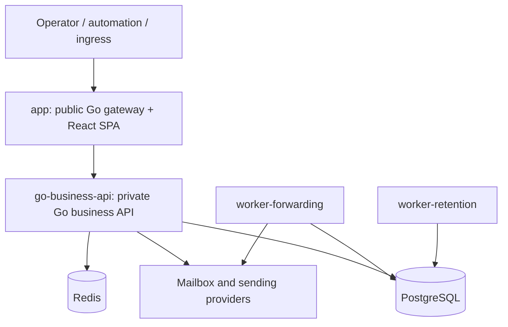

# all-Mail v2

`all-Mail` is a self-hosted email control plane for external provider mailboxes, domain mailboxes, signed inbound mail, outbound sending, mailbox portals, and automation APIs.

**v2.0.0 is the first stable Go-only release.** Go owns the public gateway, private business API, schema initialization, migrations, authentication, provider operations, forwarding, retention, health/readiness, and runtime doctors. React is compiled into the shared runtime image; Node.js is a build tool only.

> **License:** this repository is source-available under the custom all-Mail Non-Commercial License in [`LICENSE`](./LICENSE). It is not distributed under an OSI-approved open-source license. Commercial deployment, resale, hosted service, or paid-support use requires prior written permission.

## What v2 manages

- Outlook, Gmail, QQ, 163/126, iCloud, Yahoo, Zoho, Aliyun, Amazon WorkMail, Fastmail, AOL, GMX, Mail.com, Yandex, and custom IMAP/SMTP accounts;
- domains, mailboxes, aliases, portal users, quotas, forwarding, and sending configuration;
- signed Cloudflare Email Worker ingress with replay protection;
- encrypted OAuth/provider credentials and least-privilege OAuth scope profiles;
- API keys, allocation, mailbox reads, usage accounting, and audit logs.

## Stable runtime architecture


```mermaid
flowchart TD
    Operator[Operator / automation / ingress] --> App[app: public Go gateway + React SPA]
    App --> Business[go-business-api: private Go business API]
    Business --> Postgres[(PostgreSQL)]
    Business --> Redis[(Redis)]
    Business --> Providers[Mailbox and sending providers]
    Forwarding[worker-forwarding] --> Postgres
    Forwarding --> Providers
    Retention[worker-retention] --> Postgres
```

| Service | Responsibility |
| --- | --- |
| `app` | Public listener, SPA, trusted-proxy boundary, system endpoints, metrics, business proxy |
| `go-business-api` | Authentication, administration, mailbox/domain/ingress/provider/sending/portal/external APIs |
| `worker-forwarding` | Claim, lease, send, retry, and terminal forwarding transitions |
| `worker-retention` | API-log retention |
| `postgres` | Private application and migration state |
| `redis` | Private authenticated lockout, limiting, OAuth state, replay protection, and cache state |

Only `app` is host-published. It has no PostgreSQL, Redis, JWT, encryption, OAuth, ingress, provider, bootstrap, or database-role credential.

## Quick start from `v2.0.0`

```bash
git fetch --tags --prune
git switch --detach v2.0.0
cp .env.example .env
openssl rand -hex 24
```

Place the generated value in `POSTGRES_PASSWORD`, review the remaining operator settings, then choose one mode.

### Build the release locally

```bash
./scripts/compose-up.sh
```

### Pull the published multi-architecture image

```bash
ALL_MAIL_USE_PUBLISHED_IMAGE=1 \
ALL_MAIL_GO_IMAGE=ghcr.io/feng123-new/all-mail \
ALL_MAIL_IMAGE_TAG=2.0.0 \
./scripts/compose-up.sh
```

The checkout remains required because Compose, migrations, environment contracts, and operations scripts are versioned with the image.

## Verify the deployment

```bash
docker compose ps -a
curl --fail http://127.0.0.1:3002/health
curl --fail http://127.0.0.1:3002/livez
curl --fail http://127.0.0.1:3002/readyz

for service in app go-business-api worker-forwarding worker-retention; do
  docker compose exec -T "$service" allmail version --json
done

docker compose exec -T app allmail doctor api
docker compose exec -T go-business-api allmail doctor business-api
docker compose exec -T worker-forwarding allmail doctor worker forwarding
docker compose exec -T worker-retention allmail doctor worker retention
```

Official `v2.0.0` processes report version `2.0.0`, the release commit, a UTC build timestamp, and Go 1.26.5.

## First administrator login

`ADMIN_USERNAME` and `ADMIN_PASSWORD` are one-shot initializer inputs. A blank password generates a strong temporary value. Retrieve it only from the private API container:

```bash
docker compose exec go-business-api sh -lc \
  "grep '^ADMIN_USERNAME=' /var/lib/all-mail/bootstrap-admin.env && \
   grep '^ADMIN_PASSWORD=' /var/lib/all-mail/bootstrap-admin.env"
```

After login, change the password and verify that `bootstrap-admin.env` was deleted. The initializer never logs the password, and the browser never stores or prefills portal passwords.

## Release assets

The `v2.0.0` GitHub Release contains checksummed Go binaries for Linux, macOS, and Windows. The release workflow also publishes:

```text
ghcr.io/feng123-new/all-mail:2.0.0
ghcr.io/feng123-new/all-mail:2.0
ghcr.io/feng123-new/all-mail:2
ghcr.io/feng123-new/all-mail:latest
```

Binary, image, tag, package, `VERSION`, and changelog identity are enforced by release-contract tests.

## Upgrade, rollback, backup, and restore

These are stateful operations. Do not change only the image tag after a schema or secret-layout change.

- [`docs/UPGRADE.md`](docs/UPGRADE.md) — maintenance window, preflight, upgrade, validation, and rollback decision table.
- [`docs/BACKUP-RESTORE.md`](docs/BACKUP-RESTORE.md) — PostgreSQL dump, secret/data volume archives, checksums, destructive restore, and rehearsal.
- [`docs/RUNBOOK.md`](docs/RUNBOOK.md) — release mismatch, readiness, database, Redis, secret, network, worker, OAuth, session, and recovery incidents.

Never run two revisions against one persisted state and never use `docker compose down -v` during normal upgrade or recovery.

## Security model

- browser unsafe writes require a valid same-origin boundary;
- framing is denied and CSP restricts form/base/frame origins;
- administrator and mailbox session versions revoke older JWTs after security changes;
- API-key permissions are explicit and fail closed;
- OAuth state and ingress replay protection require Redis in production;
- the PostgreSQL owner is initializer-only;
- `allmail_api`, `allmail_forwarding`, and `allmail_retention` use independent generated credentials and table-scoped grants;
- the master secret volume is initializer-only and long-running processes receive read-only exports.

Report vulnerabilities through [`SECURITY.md`](SECURITY.md), not a public issue.

## Documentation

| Need | Document |
| --- | --- |
| Deployment | [`docs/DEPLOY.md`](docs/DEPLOY.md) |
| Upgrade and rollback | [`docs/UPGRADE.md`](docs/UPGRADE.md) |
| Backup and restore | [`docs/BACKUP-RESTORE.md`](docs/BACKUP-RESTORE.md) |
| Operations and recovery | [`docs/RUNBOOK.md`](docs/RUNBOOK.md) |
| Environment and secret ownership | [`docs/ENVIRONMENT.md`](docs/ENVIRONMENT.md) |
| Security boundaries | [`docs/SECURITY-BOUNDARIES.md`](docs/SECURITY-BOUNDARIES.md) |
| Go/schema compatibility | [`docs/GO-MIGRATION.md`](docs/GO-MIGRATION.md) |
| Route ownership | [`docs/ROUTE-OWNERSHIP.md`](docs/ROUTE-OWNERSHIP.md) |
| Cloudflare ingress | [`CLOUDFLARE-DEPLOY.md`](CLOUDFLARE-DEPLOY.md) |
| Release gate | [`docs/source-available-release-checklist.md`](docs/source-available-release-checklist.md) |

## Development verification

```bash
./bin/all-mail deps up
npm run dev:api
npm run dev:web
npm run verify:release
```

The full GitHub gate additionally runs real PostgreSQL and Redis integrations, race tests, `govulncheck`, Docker startup, bootstrap rotation, network/secret/database boundaries, SBOM checks, all runtime doctors, and the release gate.
