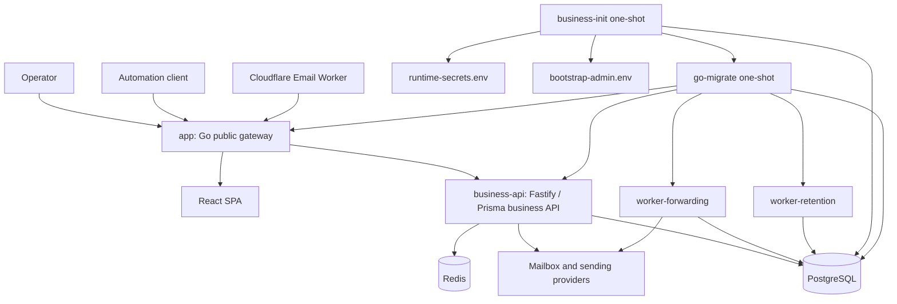

# all-Mail

`all-Mail` is a self-hostable email control plane for operators who need one place to manage:

- external mailbox providers such as Outlook, Gmail, QQ and related IMAP/SMTP families;
- domain mailboxes, aliases and portal users;
- signed inbound ingress for domain mail flows;
- outbound sending and automation-facing mailbox APIs.

The repository is **Docker-first**. The current backend is an incremental Go migration:

- Go owns the public listener, React SPA, health/readiness, trusted-proxy normalization, request IDs and metrics;
- independent Go processes own mailbox forwarding and API-log retention;
- Fastify/Prisma remains an internal business API for routes not yet ported;
- PostgreSQL and Redis remain private shared state backends.

There is one implementation for each background state machine. The TypeScript jobs runtime, in-revision rollback writer, and environment-backed administrator have been removed.

## Product shape

`all-Mail` combines several operator workflows:

- **external mailbox control** — connect and operate provider mailboxes from one admin console;
- **domain mailbox control** — manage domains, mailboxes, aliases and portal access;
- **ingress control** — receive inbound mail through a signed Cloudflare Worker path;
- **outbound sending** — manage send configurations and delivery flows;
- **automation APIs** — expose script-friendly mailbox allocation and message retrieval endpoints.

## Screenshots

| Admin sign-in | Dashboard overview |
| --- | --- |
|  |  |

The screenshots are repository-tracked and sanitized for public documentation.

## Current runtime architecture


```mermaid
flowchart TD
    Operator[Operator] --> GoAPI[app: Go public gateway]
    Automation[Automation client] --> GoAPI
    Edge[Cloudflare Email Worker] --> GoAPI

    GoAPI --> SPA[React SPA]
    GoAPI --> Legacy[business-api: Fastify / Prisma business API]

    Legacy --> Postgres[(PostgreSQL)]
    Legacy --> Redis[(Redis)]
    Legacy --> Providers[Mailbox and sending providers]

    Forwarding[worker-forwarding] --> Postgres
    Forwarding --> Providers
    Retention[worker-retention] --> Postgres

    LegacyInit[business-init one-shot] --> RuntimeSecrets[runtime-secrets.env]
    LegacyInit --> AdminSecret[bootstrap-admin.env]
    LegacyInit --> Postgres
    GoMigrate[go-migrate one-shot] --> Postgres
    LegacyInit --> GoMigrate
    GoMigrate --> Legacy
    GoMigrate --> GoAPI
    GoMigrate --> Forwarding
    GoMigrate --> Retention
```

The Go gateway does not receive PostgreSQL or Redis credentials while it owns no native business route. Its readiness checks the built SPA and the internal business API; Fastify's `/readyz` performs database and Redis protocol checks.

The initial database administrator is created only by `business-init` after Prisma migrations. The long-running Fastify API receives no administrator username, initial password, or environment-managed 2FA secret.

### Long-running services

| Service | Responsibility |
| --- | --- |
| `app` | Go public gateway, React SPA, trusted-proxy boundary, readiness, metrics and business API proxy |
| `worker-forwarding` | Go forwarding claim, send, retry, lease and terminal state transitions |
| `worker-retention` | Go API-log retention |
| `business-api` | Internal Fastify/Prisma business API; authenticates database administrators only |
| `postgres` | Application and runtime state; private to the Compose network |
| `redis` | OAuth state, rate-limit, replay and cache support; private to the Compose network |

### One-shot services

| Service | Responsibility |
| --- | --- |
| `business-init` | Split/migrate secrets, apply Prisma migrations, and create the initial database administrator under an advisory lock |
| `go-migrate` | Apply checksummed additive Go migrations through one direct `pgx` transaction |

## Provider support

| Provider family | Typical auth path | Inbox read | Junk read | Clear mailbox | Send |
| --- | --- | --- | --- | --- | --- |
| Outlook | Microsoft OAuth | Yes | Yes | Yes | Yes |
| Gmail | Google OAuth / App Password | Yes | Yes | Google OAuth only | Yes |
| QQ | IMAP / SMTP auth code | Yes | Yes | No | Yes |
| 163 / 126 | IMAP / SMTP auth code | Yes | Yes | No | Yes |
| iCloud / Yahoo / Zoho / Aliyun | IMAP / SMTP app password | Yes | Yes | No | Yes |
| Fastmail / AOL / GMX / Mail.com / Yandex | IMAP / SMTP password or app password | Yes | Yes | No | Yes |
| Amazon WorkMail | IMAP / SMTP password plus region-specific host | Yes | Yes | No | Yes |
| Custom IMAP / SMTP | User-defined server settings | Yes | Yes | No | Yes |

## Quick start

### 1. Create the single production environment file

```bash
cp .env.example .env
```

Set a strong URL-safe PostgreSQL password before Compose evaluation:

```bash
openssl rand -hex 24
```

`POSTGRES_PASSWORD` has no production default. Redis-backed login protection, API-key limits, OAuth state and ingress replay protection fail closed in production rather than falling back to process-local memory.

For Cloudflare Email Routing, edit the same file and set `INGRESS_SIGNING_SECRET`, `INGRESS_ALLOWED_SKEW_SECONDS`, and the appropriate `TRUSTED_PROXY_CIDRS` for the reverse proxy directly connected to `app`.

`ADMIN_USERNAME` and `ADMIN_PASSWORD` are one-shot initializer inputs. They are never passed to `business-api`. Leave `ADMIN_PASSWORD` blank to generate a strong temporary password.

### 2. Start the canonical stack

```bash
docker compose up -d --build --wait --wait-timeout 300
docker compose ps -a
```

Expected behavior:

- `business-init` exits after secret migration, Prisma migrations, and idempotent administrator bootstrap;
- `go-migrate` exits after Go migrations;
- `app`, `worker-forwarding`, `worker-retention`, `business-api`, `postgres` and `redis` remain healthy;
- PostgreSQL and Redis are not published to the host.

### 3. Probe health

```bash
curl http://127.0.0.1:3002/health
curl --fail http://127.0.0.1:3002/readyz

docker compose exec -T app allmail doctor api
docker compose exec -T worker-forwarding allmail doctor worker forwarding
docker compose exec -T worker-retention allmail doctor worker retention
```

Example Go health response:

```json
{
  "success": true,
  "data": {
    "status": "ok",
    "runtime": "go-gateway",
    "businessApiConfigured": true
  }
}
```

### 4. Retrieve and retire the one-time password

Long-lived generated secrets are stored in:

```text
/var/lib/all-mail/runtime-secrets.env
```

The initial administrator credential is stored separately:

```text
/var/lib/all-mail/bootstrap-admin.env
```

Retrieve it without printing all runtime secrets:

```bash
docker compose exec business-api sh -lc \
  "grep '^ADMIN_USERNAME=' /var/lib/all-mail/bootstrap-admin.env && \
   grep '^ADMIN_PASSWORD=' /var/lib/all-mail/bootstrap-admin.env"
```

Set `ALL_MAIL_PRINT_BOOTSTRAP_PASSWORD=true` only for short-lived controlled recovery. After login, the administrator is forced to change the password. A successful first rotation removes `bootstrap-admin.env`; rerunning `business-init` does not recreate it or create another administrator.

Upgrades from the old `bootstrap-secrets.env` layout are migrated automatically. The old file is split and deleted after its values have been preserved.

Only `business-init` may generate or migrate runtime secrets. The long-running API requires the existing `runtime-secrets.env` and exits if it is missing or incomplete.

## Trusted proxy contract

The Go listener discards incoming `Forwarded`, `X-Forwarded-*`, `X-Real-IP`, and `CF-Connecting-IP` values from untrusted socket peers. Only peers listed in `TRUSTED_PROXY_CIDRS` may supply a client IP or forwarded protocol. Go overwrites the downstream headers with one canonical identity, and internal Fastify trusts exactly one hop.

Do not use blanket trust. Keep `business-api` internal-only and list only the proxy or tunnel peers connected directly to `app`.

## Local development infrastructure

Production keeps PostgreSQL and Redis private. Local development explicitly publishes them through the overlay:

```bash
docker compose -f docker-compose.yml -f docker-compose.dev.yml up -d postgres redis
```

Initialize a fresh local business database and administrator explicitly:

```bash
npm --prefix server run db:migrate
ADMIN_USERNAME=admin \
ADMIN_PASSWORD=change-me-now \
BOOTSTRAP_ADMIN_SECRET_FILE=.all-mail-runtime/bootstrap-admin.env \
npm --prefix server run bootstrap:admin
npm run dev:api
```

`server/.env` contains long-lived API settings only; it does not contain administrator credentials.

Equivalent dependency helper:

```bash
./bin/all-mail deps up
```

The overlay defaults to PostgreSQL `127.0.0.1:15433` and Redis `127.0.0.1:6380`.

## Rollback policy

Rollback means deploying the previous known-good Git revision or image together with matching database and secret state:

```bash
docker compose down
git switch <known-good-tag-or-commit>
docker compose up -d --build --wait --wait-timeout 300
```

Before upgrading, back up PostgreSQL and the legacy runtime volume. This revision changes secret layout, so preserve `runtime-secrets.env`, `bootstrap-admin.env`, and a pre-upgrade backup of any old `bootstrap-secrets.env`. Do not run initializers or workers from two revisions concurrently.

## Development and verification entrypoints

| Command | Purpose |
| --- | --- |
| `npm run dev:api` | Run only the Fastify business API for local development |
| `npm --prefix server run bootstrap:admin` | Explicitly bootstrap a fresh local database administrator |
| `npm run dev:web` | Run the Vite frontend development server |
| `./bin/all-mail deps up` | Start PostgreSQL and Redis through the development overlay |
| `./bin/all-mail doctor` | Check local env resolution, infrastructure reachability and build artifacts |
| `./bin/all-mail check` | Full repository lint/test/build/worker/audit gate |
| `npm run test:runtime` | Runtime and environment-contract tests |

Production startup remains Docker Compose. The repository CLI does not expose a parallel Node production topology.

## Documentation map

| Need | Canonical document |
| --- | --- |
| Deploy, update, smoke check and rollback | [`docs/DEPLOY.md`](docs/DEPLOY.md) |
| Day-2 operations and recovery | [`docs/RUNBOOK.md`](docs/RUNBOOK.md) |
| Environment variables and secret ownership | [`docs/ENVIRONMENT.md`](docs/ENVIRONMENT.md) |
| Current Go/Fastify ownership and migration rules | [`docs/GO-MIGRATION.md`](docs/GO-MIGRATION.md) |
| Local API/frontend development | [`docs/advanced-runtime.md`](docs/advanced-runtime.md) |
| Remaining vertical business-route ports | [`docs/internal/runtime-migration-roadmap.md`](docs/internal/runtime-migration-roadmap.md) |
| External mailbox operations | [`docs/external-email-management-guide.md`](docs/external-email-management-guide.md) |
| Cloudflare ingress | [`CLOUDFLARE-DEPLOY.md`](CLOUDFLARE-DEPLOY.md) |
| Contribution workflow | [`CONTRIBUTING.md`](CONTRIBUTING.md) |

## Repository layout

```text
├── core/                            # Go gateway, workers, migrations and runtime contracts
├── server/                          # Compatibility Fastify/Prisma business API and one-shot admin bootstrap
├── web/                             # React admin console and mailbox portal UI
├── cloudflare/workers/allmail-edge/ # Signed inbound email Worker
├── docker/                          # One-shot/bootstrap and business API entrypoint
├── scripts/                         # Secret migration, verification and helper tooling
├── docs/                            # Public operator docs and internal migration notes
├── Dockerfile                       # Go runtime plus built React SPA
├── Dockerfile.server                # Compatibility Fastify API and initializer runtime
├── docker-compose.yml               # Canonical production topology
└── docker-compose.dev.yml           # Local PostgreSQL/Redis host-port overlay
```

## Remaining migration boundary

Fastify/Prisma still owns database-backed admin and mailbox-portal authentication, OAuth, API keys, domain/mailbox management, provider mailbox operations, ingress business handling and the existing business-schema migration history.

The removed environment administrator is not a fallback. Remaining capabilities must move to Go as vertical slices with authorization, validation, transaction, parity and failure-injection tests.

## License

This repository is released under the custom **all-Mail Non-Commercial License**.

- non-commercial use, study, modification and redistribution are allowed under the license terms;
- commercial use is not allowed without prior written permission;
- contact the repository owner to discuss commercial licensing.
