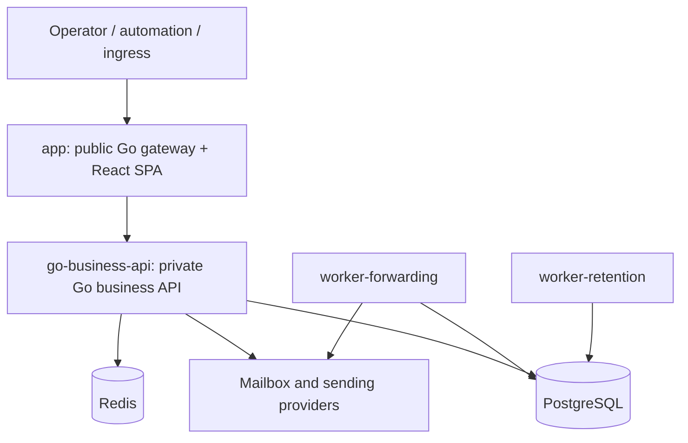

# all-Mail v2

`all-Mail` is an open-source, self-hosted email control plane for external provider mailboxes, domain mailboxes, signed inbound mail, outbound sending, mailbox portals, and automation APIs.

**v2.1.2 is the current stable Go-only release; v2.0.0 was the first stable Go-only release.** Go owns the public gateway, private business API, schema initialization, migrations, authentication, provider operations, forwarding, retention, health/readiness, and runtime doctors. React is compiled into the shared runtime image; Node.js is a build tool only.

> **Open source:** `all-Mail` is licensed under the GNU Affero General Public License v3.0 only (`AGPL-3.0-only`). See [`LICENSE`](./LICENSE). The AGPL is an OSI-approved copyleft license designed for software used over computer networks.

## What v2 manages

- Outlook, Gmail, QQ, 163/126, iCloud, Yahoo, Zoho, Aliyun, Amazon WorkMail, Fastmail, AOL, GMX, Mail.com, Yandex, and custom IMAP/SMTP accounts;
- domains, mailboxes, aliases, portal users, quotas, forwarding, and sending configuration;
- signed Cloudflare Email Worker ingress with replay protection;
- encrypted OAuth/provider credentials and least-privilege OAuth scope profiles;
- API keys, allocation, mailbox reads, usage accounting, audit logs, and a generated OpenAPI 3.1 contract.

## v2.1.2 personal-deployment patch

v2.1.2 closes the post-v2.1.1 personal-deployment patch line:

- publish the reviewed Mail.com Premium-only IMAP/SMTP defaults and official folder mappings;
- make Gmail and Outlook OAuth configuration profile-driven with explicit `minimal`, `send`, `manage`, and `full` capabilities, effective scopes, and reauthorization guidance;
- extend the secret-safe production-host preflight with Redis `vm.overcommit_memory`, available-memory, disk, inode, application-port, and Docker storage-driver checks;
- document the difference between public protocol/integration evidence and operator-owned live-provider validation;
- require a guarded, destructive backup-and-restore rehearsal against synthetic PostgreSQL, secret-volume, Redis, API-key, domain, mailbox, and message state in CI.

No database migration, durable-secret rotation, public route removal, authorization change, provider credential-format change, or production service/network/volume topology change is introduced from v2.1.1.

## Stable runtime architecture


```mermaid
flowchart TD
    Operator[Operator / automation / ingress] --> App[app: public Go gateway + React SPA]
    App --> Business[go-business-api: private Go business API]
    Business --> Postgres[(PostgreSQL)]
    Business --> Redis[(Redis)]
    Business --> Providers[Mailbox and sending providers]
    Forwarding[worker-forwarding] --> Postgres
    Forwarding --> Providers
    Retention[worker-retention] --> Postgres
```

| Service | Responsibility |
| --- | --- |
| `app` | Public listener, SPA, trusted-proxy boundary, health/readiness, protected metrics, OpenAPI, and business proxy |
| `go-business-api` | Authentication, administration, mailbox/domain/ingress/provider/sending/portal/external APIs |
| `worker-forwarding` | Claim, lease, send, retry, and terminal forwarding transitions |
| `worker-retention` | API-log retention |
| `postgres` | Private application and migration state |
| `redis` | Private authenticated lockout, limiting, OAuth state, replay protection, and cache state |

Only `app` is host-published. It has no PostgreSQL, Redis, JWT, encryption, OAuth, ingress, provider, bootstrap, or database-role credential.

## Quick start from `v2.1.2`

The supported production baseline is a single Linux host with Bash 4+, Python 3.9+, Git, OpenSSL, Docker Engine, Docker Compose v2, Docker daemon access, Redis-compatible `vm.overcommit_memory=1`, and the capacity thresholds checked by `host-preflight.sh`.

```bash
git fetch --tags --prune
git switch --detach v2.1.2
./scripts/host-preflight.sh
cp .env.example .env
openssl rand -hex 24
```

Place the generated value in `POSTGRES_PASSWORD`, review the remaining operator settings, then start the release:

```bash
./scripts/compose-up.sh
```

To pull the published multi-architecture image:

```bash
ALL_MAIL_USE_PUBLISHED_IMAGE=1 \
ALL_MAIL_GO_IMAGE=ghcr.io/feng123-new/all-mail \
ALL_MAIL_IMAGE_TAG=2.1.2 \
./scripts/compose-up.sh
```

The matching checkout remains required because Compose, migrations, environment contracts, generated OpenAPI metadata, and operations scripts are versioned with the image.

## Verify the deployment

```bash
docker compose ps -a
curl --fail http://127.0.0.1:3002/health
curl --fail http://127.0.0.1:3002/livez
curl --fail http://127.0.0.1:3002/readyz
curl --fail http://127.0.0.1:3002/openapi.json

for service in app go-business-api worker-forwarding worker-retention; do
  docker compose exec -T "$service" allmail version --json
done

docker compose exec -T app allmail doctor api
docker compose exec -T go-business-api allmail doctor business-api
docker compose exec -T worker-forwarding allmail doctor worker forwarding
docker compose exec -T worker-retention allmail doctor worker retention
```

Official v2.1.2 processes report version `2.1.2`, the release commit, a UTC build timestamp, and Go 1.26.5.

`/metrics` is loopback-only by default and is controlled by `METRICS_ALLOWED_CIDRS`. Do not use an allow-all network.

## First administrator login

`ADMIN_USERNAME` and `ADMIN_PASSWORD` are one-shot initializer inputs. A blank password generates a strong temporary value. Retrieve it only from the private API container:

```bash
docker compose exec go-business-api sh -lc \
  "grep '^ADMIN_USERNAME=' /var/lib/all-mail/bootstrap-admin.env && \
   grep '^ADMIN_PASSWORD=' /var/lib/all-mail/bootstrap-admin.env"
```

After login, change the password and verify that `bootstrap-admin.env` was deleted. The initializer never logs the password, and the browser never stores or prefills portal passwords.

## Release assets

The v2.1.2 GitHub Release contains checksummed Go binaries for Linux, macOS, and Windows, a CycloneDX SBOM, `SHA256SUMS`, and the published image digest. The release workflow also publishes:

```text
ghcr.io/feng123-new/all-mail:2.1.2
ghcr.io/feng123-new/all-mail:2.1
ghcr.io/feng123-new/all-mail:2
ghcr.io/feng123-new/all-mail:latest
```

Binary, image, tag, package, `VERSION`, OpenAPI, and changelog identity are enforced by release contracts.

## Upgrade, rollback, backup, and restore

These are stateful operations. Never run two revisions against one persisted state and never use `docker compose down -v` during normal upgrade or recovery.

- [`docs/DEPLOY.md`](docs/DEPLOY.md) — installation and production-host requirements.
- [`docs/UPGRADE.md`](docs/UPGRADE.md) — maintenance window, preflight, upgrade, validation, and rollback decision table.
- [`docs/BACKUP-RESTORE.md`](docs/BACKUP-RESTORE.md) — PostgreSQL dump, secret/data volume archives, checksums, destructive restore, and rehearsal.
- [`docs/RUNBOOK.md`](docs/RUNBOOK.md) — release mismatch, readiness, database, Redis, secret, network, worker, OAuth, session, and recovery incidents.
- [`docs/OBSERVABILITY.md`](docs/OBSERVABILITY.md) — metrics, doctors, heartbeats, logs, privacy, and alerts.
- [`docs/PROVIDER-VALIDATION.md`](docs/PROVIDER-VALIDATION.md) — provider evidence levels, live-account caveats, OAuth profiles, and personal canary steps.

## Security model

- browser unsafe writes require a valid same-origin boundary;
- administrator and mailbox sessions use HttpOnly cookies and durable session-version revocation;
- API-key permissions are explicit and fail closed;
- OAuth state and ingress replay protection require Redis in production;
- the PostgreSQL owner is initializer-only;
- runtime database identities and secret exports are least privilege and read-only;
- provider egress rejects unsafe destinations and pins accepted DNS results;
- metrics authorization uses the direct TCP peer and ignores forwarded client headers.

Report vulnerabilities through [`SECURITY.md`](SECURITY.md), not a public issue.

## Contributing

Contributions, bug reports, documentation improvements, provider compatibility fixes, and operational feedback are welcome. Start with [`CONTRIBUTING.md`](CONTRIBUTING.md), use the repository issue templates for reproducible reports, and open focused pull requests with truthful verification evidence.

Contributions are licensed under the same `AGPL-3.0-only` terms as the project. Security vulnerabilities should continue to follow [`SECURITY.md`](SECURITY.md) rather than public issue discussion.

## Development verification

```bash
./bin/all-mail deps up
npm run dev:api
npm run dev:web
npm run verify:release
```

The required GitHub gates additionally run real PostgreSQL and Redis integrations, race tests, `govulncheck`, frontend bundle and desktop/mobile Chromium contracts, Docker startup, bootstrap rotation, an isolated destructive backup/restore rehearsal, network/secret/database boundaries, SBOM checks, all runtime doctors, OpenAPI consistency, cross-platform builds, and the release gate.

## License

Copyright (c) 2026 fengyong.

`all-Mail` is free and open-source software licensed under the **GNU Affero General Public License v3.0 only** (`AGPL-3.0-only`). You may use, study, modify, redistribute, and use the software commercially subject to the license terms. In particular, modified versions made available to users over a computer network must provide those users an opportunity to obtain the corresponding source as required by AGPLv3.

See [`LICENSE`](LICENSE) for the complete license text.
