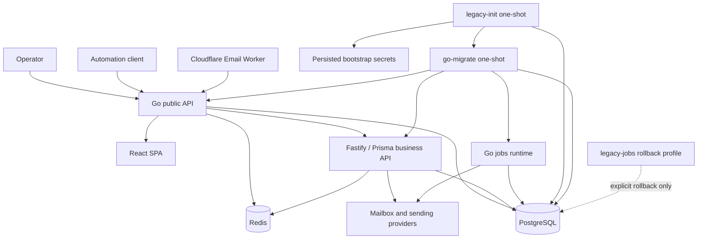

# all-Mail

`all-Mail` is a self-hostable email control plane for operators who need one place to manage:

- external mailbox providers such as Outlook, Gmail, QQ and related IMAP/SMTP families;
- domain mailboxes, aliases and portal users;
- signed inbound ingress for domain mail flows;
- outbound sending and automation-facing mailbox APIs.

The repository is **Docker-first**. The current production topology is an incremental Go migration, not a completed Fastify replacement:

- Go owns the public listener, React SPA delivery, health/readiness, request IDs, metrics, API-log retention and forwarding execution;
- Fastify/Prisma remains the authoritative business API for admin, mailbox, domain, OAuth, portal, API-key and ingress routes;
- PostgreSQL and Redis remain shared state backends;
- the former Node jobs runtime is available only through an explicit rollback profile.

## Product shape

`all-Mail` combines several operator workflows in one system:

- **external mailbox control** — connect and operate provider mailboxes from one admin console;
- **domain mailbox control** — manage domains, mailboxes, aliases and portal access;
- **ingress control** — receive inbound mail through a signed Cloudflare Worker path when needed;
- **outbound sending** — manage send configurations and delivery flows;
- **automation APIs** — expose script-friendly mailbox allocation and message retrieval endpoints.

## Screenshots

| Admin sign-in | Dashboard overview |
| --- | --- |
|  |  |

The screenshots are repository-tracked and sanitized for public documentation.

## Current runtime architecture


```mermaid
flowchart TD
    Operator[Operator] --> GoAPI[Go public API]
    Automation[Automation client] --> GoAPI
    Worker[Cloudflare Email Worker] --> GoAPI

    GoAPI --> SPA[React SPA]
    GoAPI --> Legacy[Fastify / Prisma business API]
    GoAPI --> Postgres[(PostgreSQL)]
    GoAPI --> Redis[(Redis)]

    Legacy --> Postgres
    Legacy --> Redis
    Legacy --> Providers[Mailbox and sending providers]

    GoJobs[Go jobs runtime] --> Postgres
    GoJobs --> Providers

    LegacyInit[legacy-init one-shot] --> Postgres
    LegacyInit --> SecretVolume[Persisted bootstrap secrets]
    GoMigrate[go-migrate one-shot] --> Postgres
    LegacyInit --> GoMigrate
    GoMigrate --> Legacy
    GoMigrate --> GoAPI
    GoMigrate --> GoJobs

    LegacyRollback[legacy-jobs rollback profile] -. explicit rollback only .-> Postgres
```

The default long-running services are:

| Service | Responsibility |
| --- | --- |
| `app` | Go public listener, SPA, readiness, metrics and legacy proxy |
| `go-jobs` | Go API-log retention and forwarding workers |
| `legacy-api` | Fastify/Prisma business API that has not yet been ported |
| `postgres` | Application and runtime state |
| `redis` | OAuth state, rate-limit, replay and cache support |

Two one-shot services run before the long-running application processes:

| Service | Responsibility |
| --- | --- |
| `legacy-init` | Generate/persist bootstrap secrets, export only the forwarding encryption key and apply Prisma migrations |
| `go-migrate` | Apply checksummed additive Go migrations under a PostgreSQL advisory lock |

`legacy-jobs` is **not** started by the default profile. It exists only as a temporary rollback owner while the Go forwarding and retention cutover is being validated.

## Provider support

| Provider family | Typical auth path | Inbox read | Junk read | Clear mailbox | Send |
| --- | --- | --- | --- | --- | --- |
| Outlook | Microsoft OAuth | Yes | Yes | Yes | Yes |
| Gmail | Google OAuth / App Password | Yes | Yes | Google OAuth only | Yes |
| QQ | IMAP / SMTP auth code | Yes | Yes | No | Yes |
| 163 / 126 | IMAP / SMTP auth code | Yes | Yes | No | Yes |
| iCloud / Yahoo / Zoho / Aliyun | IMAP / SMTP app password | Yes | Yes | No | Yes |
| Fastmail / AOL / GMX / Mail.com / Yandex | IMAP / SMTP password or app password | Yes | Yes | No | Yes |
| Amazon WorkMail | IMAP / SMTP password plus region-specific host | Yes | Yes | No | Yes |
| Custom IMAP / SMTP | User-defined server settings | Yes | Yes | No | Yes |

## Quick start

### 1. Choose an environment template

Default Docker deployment:

```bash
cp .env.example .env
```

Cloudflare Email Routing / signed ingress deployment:

```bash
cp .env.cloudflare.example .env
```

Replace the shipped ingress placeholder before enabling ingress.

### 2. Start the canonical stack

```bash
docker compose up -d --build --wait --wait-timeout 240
docker compose ps -a
```

Expected behavior:

- `legacy-init` exits successfully after bootstrap and Prisma migration work;
- `go-migrate` exits successfully after additive Go migrations;
- `app`, `go-jobs`, `legacy-api`, `postgres` and `redis` remain running;
- `legacy-jobs` is absent unless the `rollback` profile was explicitly enabled.

### 3. Probe health

```bash
curl http://127.0.0.1:3002/health
curl --fail http://127.0.0.1:3002/readyz
docker compose exec -T app allmail doctor api
docker compose exec -T go-jobs allmail doctor jobs
```

The Go health response identifies the migration bridge, for example:

```json
{
  "success": true,
  "data": {
    "status": "ok",
    "runtime": "go-migration-bridge",
    "apiMode": "bridge",
    "legacyConfigured": true
  }
}
```

### 4. Retrieve a generated first-login password

`JWT_SECRET`, `ENCRYPTION_KEY` and `ADMIN_PASSWORD` may be blank on first boot. `legacy-init` generates missing values and persists them in the legacy runtime volume.

The password is not printed by default. Retrieve it from the service that owns the volume:

```bash
docker compose exec legacy-api sh -lc \
  "grep '^ADMIN_PASSWORD=' /var/lib/all-mail/bootstrap-secrets.env | cut -d= -f2-"
```

Set `ALL_MAIL_PRINT_BOOTSTRAP_PASSWORD=true` only for short-lived recovery in a controlled terminal. Change a generated password immediately after first login.

## Rollback-only Node jobs runtime

The rollback service is deliberately excluded from normal startup.

To transfer both migrated jobs back to Node:

```bash
# 1. Stop the Go jobs writer and wait for shutdown drain.
docker compose stop go-jobs

# 2. Start the rollback profile. The service forces both owners to legacy.
docker compose --profile rollback up -d legacy-jobs

# 3. Inspect health before resuming traffic.
docker compose --profile rollback ps
docker compose logs legacy-jobs --tail=200
```

To return ownership to Go:

```bash
docker compose --profile rollback stop legacy-jobs
docker compose up -d go-jobs
```

Do not run Go and Node writers for the same state machine concurrently. The PostgreSQL owner lock is a final guard, not a substitute for an intentional handover.

## Verification entrypoints

| Command | Purpose |
| --- | --- |
| `./bin/all-mail doctor` | Compatibility source-runtime readiness check |
| `./bin/all-mail check` | Full repository lint/test/build/worker/audit gate |
| `npm run test:runtime` | Runtime and environment-contract tests |
| `npm run docker:rollback:jobs` | Start the rollback-only Node jobs service |
| `npm run docker:rollback:stop` | Stop the rollback-only Node jobs service |

The CI workflow keeps dependency audit and Docker smoke as independent jobs, then combines both in `release-gate`. An audit failure therefore remains blocking without preventing Docker integration diagnostics from running.

## Documentation map

| Need | Canonical document |
| --- | --- |
| Deploy, update, smoke check and rollback | [`docs/DEPLOY.md`](docs/DEPLOY.md) |
| Day-2 operations and recovery | [`docs/RUNBOOK.md`](docs/RUNBOOK.md) |
| Environment variables and template ownership | [`docs/ENVIRONMENT.md`](docs/ENVIRONMENT.md) |
| Current Go/Fastify ownership and migration rules | [`docs/GO-MIGRATION.md`](docs/GO-MIGRATION.md) |
| Staged removal plan for legacy runtime code | [`docs/internal/rewrite/runtime-consolidation-plan.md`](docs/internal/rewrite/runtime-consolidation-plan.md) |
| External mailbox operations | [`docs/external-email-management-guide.md`](docs/external-email-management-guide.md) |
| Cloudflare ingress | [`CLOUDFLARE-DEPLOY.md`](CLOUDFLARE-DEPLOY.md) |
| Secondary Node source runtime | [`docs/advanced-runtime.md`](docs/advanced-runtime.md) |
| Contribution workflow | [`CONTRIBUTING.md`](CONTRIBUTING.md) |

## Repository layout

```text
├── core/                            # Go listener, jobs, migrations and runtime contracts
├── server/                          # Compatibility Fastify/Prisma business API
├── web/                             # React admin console and mailbox portal UI
├── cloudflare/workers/allmail-edge/ # Signed inbound email Worker
├── docker/                          # Compatibility runtime entrypoint
├── scripts/                         # Verification, bootstrap and source-runtime helpers
├── docs/                            # Public operator docs and internal migration notes
├── Dockerfile                       # Go runtime plus built React SPA
├── Dockerfile.legacy                # Compatibility Fastify runtime
└── docker-compose.yml               # Canonical production topology
```

## Secondary source runtime

The npm/CLI source path starts the compiled Fastify API and Node jobs process directly. It is retained for advanced debugging and compatibility, but it is **not topology-equivalent** to the canonical Docker path and must not be used as proof that the Go gateway or Go workers are healthy.

See [`docs/advanced-runtime.md`](docs/advanced-runtime.md).

## License

This repository is released under the custom **all-Mail Non-Commercial License**.

- non-commercial use, study, modification and redistribution are allowed under the license terms;
- commercial use is not allowed without prior written permission;
- contact the repository owner to discuss commercial licensing.
